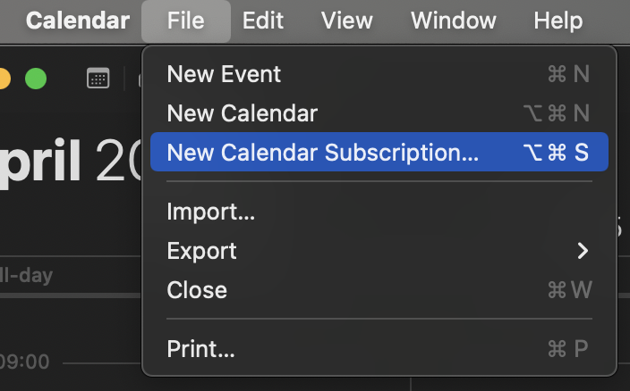

### Step 1
Open the Calendar app and click on `File` > `New Calendar Subscription`.

### Step 2
Enter the calendar url and click `Subscribe`.

### Step 3
Enter the name you want to assign to the calendar and choose the color. In the auto-refresh field choose either `every hour` or `every day`.

**Note:** in the field `location` you can choose whether to save the calendar only on your Mac or synchronize it with iCloud. If you choose the second option, the calendar will be synced on all your devices including iPad and iPhone.

