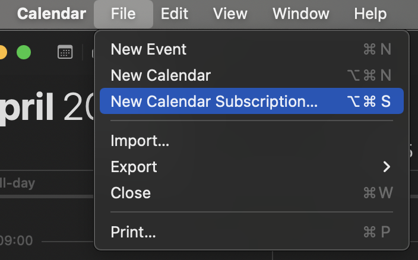
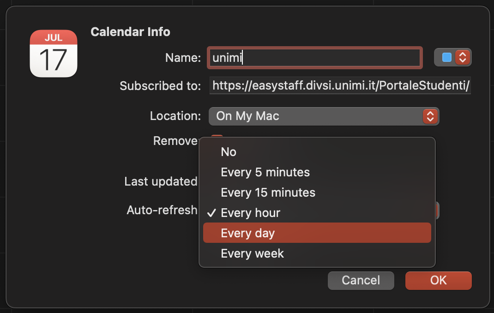

### 1° passo
Apri l'app Calendario e clicca su `File` > `Nuova iscrizione calendario`.

### 2° passo
Incolla l'url del calendario e clicca su `Iscriviti`.

### 3° passo
Inserisci il nome che vuoi assegnare al calendario e scegli il colore. Nel campo auto-refresh scegli come opzione `ogni ora` oppure `ogni giorno`.

**Nota:** nel campo `location` puoi scegliere se salvare il calendario solo sul tuo Mac oppure sincronizzarlo con iCloud. Se scegli la seconda opzione, il calendario verrà sincronizzato su tutti i tuoi dispositivi iPad e iPhone inclusi.

