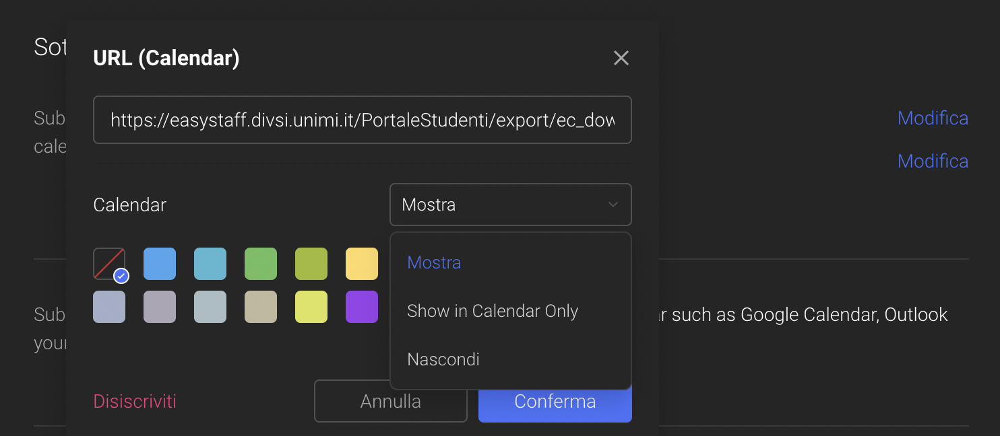

To add a calendar subscription in Tick Tick there are several ways depending on the device you are using. For simplicity's sake, here are the instructions for adding it from your browser.

### 1st step
Open the Tick Tick webapp and go to [settings](https://ticktick.com/webapp/#settings).

### 2nd step
Click on `Calendars and email`.

### 3rd step
Click on `Add Calendar` and from the submenu click on `URL`.

### 4th step
Enter the calendar's url and click `Confirm`. You will now be able to see the lesson calendar both in the list of tasks for the day and in the calendar view.

### Remarks
- It may happen that the calendar does not synchronise correctly between the browser and the app, in which case you can add it again from the app.
- The calendar has 3 display modes: hidden, visible only in the calendar, visible in the calendar and in the task list. The mode can be chosen by clicking the `Edit` button after following steps 1 and 2.

