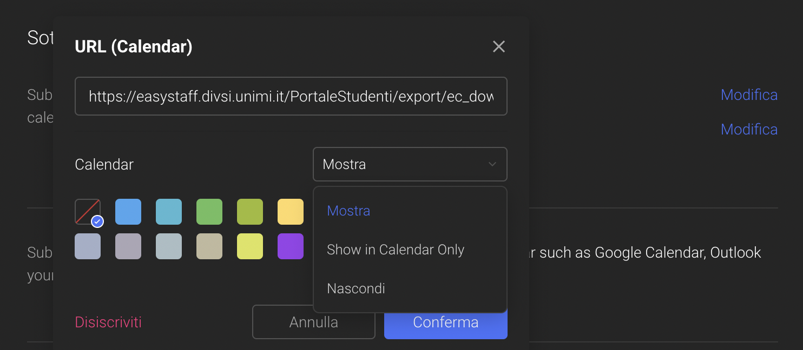

Per aggiungere l'iscrizione ad un calendario su Tick Tick ci sono diversi modi a seconda del dispositivo che si sta utilizzando. Per semplicità, qui vengono riportate le istruzioni per aggiungerlo da browser.

### 1° step
Apri la webapp di Tick Tick e vai nelle [impostazioni](https://ticktick.com/webapp/#settings).

### 2° step
Clicca su `Calendars and email`.

### 3° step
Clicca su `Add Calendar` e dal sottomenu che si apre clicca su `URL`.

### 4° step
Inserisci l'URL e clicca su `Conferma`. Da ora potrai vedere il calendario delle lezioni sia nella lista dei task della giornata, sia nella visione a calendario.

### Osservazioni
- Può capitare che il calendario non si sincronizzi correttamente tra browser e app, nel caso basta riaggiungerlo dall'applicazione
- Il calendario ha 3 modalità di visualizzazione: nascosto, visible solo nel calendario, visibile nel calendario e nella lista di task. La modalità può essere scelta cliccando sul pulsante `Modifica` dopo aver seguito gli step 1 e 2.

